# Front-End MCP Broker with AAP Event-Driven Ansible (EDA)

> Make MCP **messaging-loose-coupled** for enterprise: durable queueing, per-key ordering, deadlines/cancel, idempotency, and saga-style consistency—while keeping MCP’s great DX for LLMs (ChatGPT, Copilot, etc.).

---

## 🔥 Problem Statement (Upfront)

Modern MCP (Model Context Protocol) sessions are **request/response and tied to a live client connection**. That’s fine for human-paced lookups, but it breaks for **time-critical and order-critical enterprise workflows** spanning multiple systems.

**Gaps we must close:**
- **No durable command queue** → work can be lost on disconnect; no replay/backpressure.
- **No per-key ordering** → steps like _provision → configure → enable_ can race/out-of-order.
- **Weak SLA controls** → no first-class deadlines, cancellation, throttling, or priority.
- **No exactly-once/idempotency** → retries can double-apply side effects.
- **Limited multi-step consistency** → no saga/compensation across tools.
- **Auditing & tenancy gaps** → hard to prove “who did what, when” across org boundaries.

**Enterprise requirement:** Keep MCP as the **interface & schema** for LLMs, but add **messaging semantics** (durable queue, ordering, retries, DLQ) and **workflow orchestration** (sagas) behind a **Front-End MCP Broker**.

---

## 🎯 Goals & Non-Goals

**Goals**
- Preserve MCP tool UX for LLMs; add durability, order, deadlines, cancel, idempotency.
- Route via **AAP EDA rulebooks** to automation/adapters/MCP servers.
- Provide **observability, audit, and multi-tenant RBAC**.

**Non-Goals**
- Replacing MCP or AAP: we **compose** them.
- ACID two-phase commit across external systems: we use **sagas + compensation** instead.

---

## 🏗️ Architecture Overview

### Component Diagram

```mermaid
flowchart LR
    LLM[LLM Client<br/>(ChatGPT/Copilot)] -- MCP/SSE --> FEG[MCP Front-End Broker]
    FEG -- produce --> K1[(Kafka/Redpanda<br/>mcp.commands)]
    FEG <-- consume --> K2[(Kafka/Redpanda<br/>mcp.results)]
    K1 --> EDA[AAP Event-Driven Ansible<br/>Rulebooks]
    EDA --> CTRL[AAP Controller<br/>Execution Environments]
    CTRL --> ADP[Adapters / Jobs<br/>(call MCP servers, HTTP, gRPC, CLI)]
    ADP -- POST progress/result --> FEG
    FEG -. audit/metrics .- OBS[OTel/Grafana/ELK]
    FEG -. RBAC/Tenant .- IAM[OIDC/mTLS/RBAC]
    K1 --> DLQ[(mcp.deadletter)]
```


```mermaid
sequenceDiagram
    participant U as LLM User
    participant L as LLM (MCP client)
    participant B as Front-End MCP Broker
    participant K as Kafka (mcp.commands)
    participant E as EDA Rulebook
    participant C as AAP Controller/EE
    participant A as Adapter/Worker

    U->>L: Invoke tool (MCP tools/call)
    L->>B: MCP tools/call (tool, method, args, deadline, ordering_key,…)
    B->>K: Produce envelope (durable, partitioned by ordering_key)
    K->>E: Event consumed
    E->>C: Run job template (adapter)
    C->>A: Execute adapter (with correlation_id)
    A->>B: POST progress (10%, 50%, ...)
    B-->>L: Stream progress over MCP/SSE
    A->>B: POST final result
    B->>K: Publish mcp.results (audit/replay)
    B-->>L: Stream final result
```

**Message Envelope (Transport Contract)**

```json
{
  "envelope_version": "1.0",
  "correlation_id": "uuid-v7",
  "idempotency_key": "uuid-or-client-key",
  "tenant_id": "acme",
  "user_id": "rb",
  "tool": "git",
  "method": "clone",
  "args": { "repo": "https://..." },
  "ordering_key": "tenant:rb:conv:42",
  "deadline_ms": 30000,
  "priority": "normal",
  "accept_partials": true,
  "accept_async": true,
  "saga_id": "uuid-v7",
  "saga_step": 1,
  "compensation": { "tool": "git", "method": "delete", "args": { "repo": "..." } }
}
```

Partitioning key: ordering_key → strict per-key ordering.

Deadlines/Cancel: end-to-end SLA and cancellation via control messages.

Idempotency: de-dupe at broker and adapter with idempotency_key.

**EDA Rulebook (Kafka source → Job Template)**

```yaml
# rulebooks/rulebook_mcp.yml
---
sources:
  - kafka:
      host: kafka-kafka-bootstrap:9092
      topics:
        - mcp.commands
      group_id: eda-mcp
      tls: false

rules:
  - name: route_git_clone
    condition: event.tool == "git" and event.method == "clone"
    actions:
      - run_job_template:
          name: mcp-git-clone-adapter
          organization: Default
          job_args:
            extra_vars:
              correlation_id: "{{ event.correlation_id }}"
              broker_url: "https://mcp-broker.svc/results"
              args: "{{ event.args }}"
              tenant_id: "{{ event.tenant_id }}"
              deadline_ms: "{{ event.deadline_ms | default(60000) }}"
  - name: default_deadletter
    condition: event.tool is not defined or event.method is not defined
    actions:
      - kafka:
          host: kafka-kafka-bootstrap:9092
          topic: mcp.deadletter
          value: "{{ event }}"
```


**Adapter Playbook (Example)**

```yaml
# playbooks/mcp_git_clone_adapter.yml
---
- name: Git clone adapter
  hosts: localhost
  gather_facts: false
  vars:
    repo: "{{ args.repo }}"
    dest: "/tmp/work/{{ correlation_id }}"
  tasks:
    - name: Report progress (10%)
      uri:
        url: "{{ broker_url }}/{{ correlation_id }}/progress"
        method: POST
        body_format: json
        body: { stage: "starting", percent: 10 }

    - name: Clone repo
      ansible.builtin.git:
        repo: "{{ repo }}"
        dest: "{{ dest }}"
        version: "HEAD"

    - name: Report result
      uri:
        url: "{{ broker_url }}/{{ correlation_id }}"
        method: POST
        body_format: json
        body:
          status: "ok"
          result: { path: "{{ dest }}" }
```
      
**Broker Skeleton (FastAPI + aiokafka)**

```python
# services/mcp_broker.py (skeletal)
import asyncio, json, uuid, time
from fastapi import FastAPI, Request
from aiokafka import AIOKafkaProducer, AIOKafkaConsumer

app = FastAPI()
KAFKA = "kafka-kafka-bootstrap:9092"
CMD_TOPIC, RES_TOPIC = "mcp.commands", "mcp.results"
waiters = {}  # replace with Redis in production

@app.on_event("startup")
async def startup():
    app.state.producer = AIOKafkaProducer(bootstrap_servers=KAFKA, linger_ms=5)
    await app.state.producer.start()
    app.state.consumer = AIOKafkaConsumer(
        RES_TOPIC, bootstrap_servers=KAFKA, group_id="broker",
        enable_auto_commit=True, auto_offset_reset="latest"
    )
    await app.state.consumer.start()
    asyncio.create_task(result_loop())

async def result_loop():
    async for m in app.state.consumer:
        ev = json.loads(m.value.decode())
        cid = ev.get("correlation_id")
        fut = waiters.get(cid)
        if fut and not fut.done():
            fut.set_result(ev)

@app.post("/mcp/tools/call")
async def tools_call(req: Request):
    body = await req.json()
    cid = str(uuid.uuid4())
    envelope = {
      "envelope_version":"1.0","correlation_id":cid,
      "idempotency_key": body.get("idempotency_key", cid),
      "tenant_id": body.get("tenant_id"), "user_id": body.get("user_id"),
      "tool": body["tool"], "method": body["method"],
      "args": body.get("args", {}),
      "ordering_key": body.get("ordering_key") or body.get("user_id"),
      "deadline_ms": body.get("deadline_ms", 30000), "accept_partials": True
    }
    await app.state.producer.send_and_wait(CMD_TOPIC, json.dumps(envelope).encode())
    fut = asyncio.get_event_loop().create_future()
    waiters[cid] = fut
    try:
        res = await asyncio.wait_for(fut, timeout=envelope["deadline_ms"]/1000)
        return res
    except asyncio.TimeoutError:
        return {"status":"accepted","correlation_id":cid,"note":"continuing async"}
    finally:
        waiters.pop(cid, None)

@app.post("/results/{correlation_id}")
async def post_result(correlation_id: str, req: Request):
    ev = await req.json(); ev["correlation_id"] = correlation_id
    await app.state.producer.send_and_wait(RES_TOPIC, json.dumps(ev).encode())
    return {"ok": True}

@app.post("/results/{correlation_id}/progress")
async def post_progress(correlation_id: str, req: Request):
    _ = await req.json()
    # Optionally push progress to connected MCP client via SSE/WebSocket
    return {"ok": True}
```


**Security, Tenancy, Compliance**

AuthN: OIDC/JWT to broker; mTLS to Kafka; AAP RBAC to job templates.

AuthZ: map tenant_id/user_id → allowed {tool,method}.

Secrets: Vault/KMS; never embed credentials in events.

Audit: immutable event log + broker DB; correlate via correlation_id.

PII/Data boundaries: scope envelopes to minimal required fields.

**Observability**

OpenTelemetry tracing (broker → Kafka → EDA → Controller → Adapter).

SLIs: p50/p95/p99 latency per tool; timeout rate; DLQ rate; queue depth.

Dashboards: per-tenant throughput, deadline violations, retry storms.

**Operational Semantics Gained**

Durability & replay of commands/results.

Strict per-key ordering via partitioning.

Deadlines, cancellation, priority end-to-end.

Idempotency & dedupe with DLQ isolation.

Saga orchestration (workflows + compensation).

Full audit & multi-tenant RBAC.
